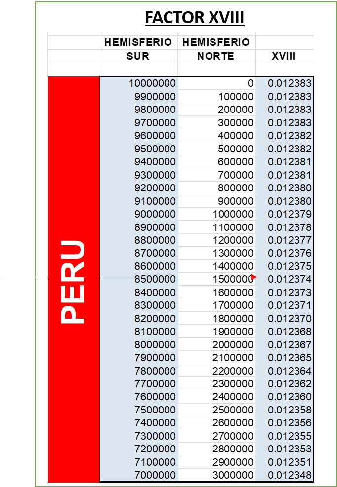
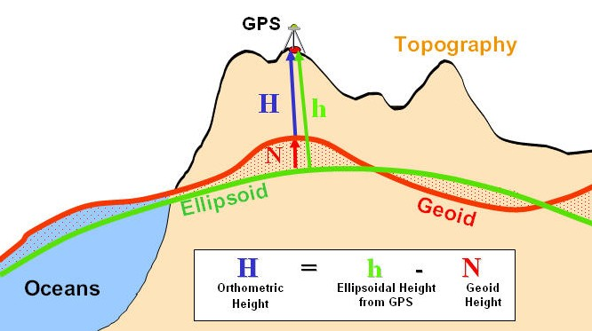

# TRANSFORMACIÓN DE COORDENADAS TOPOGRÁFICAS GEOREFERENCIADAS A UTM


Las coordenadas topográficas se puede decir que son distancias **puras** ya que son medidas en el terreno de estudio, pero las coordenadas UTM tienen una sola posición en el mundo, por lo cual es necesario transformar las coordenadas topográficas a UTM.
Para hacer este procedimiento primero tenemos que hallar el factor combinado para modificar las distancias, después se calculan las coordenadas UTM del punto deseado.

## FACTOR COMBINADO
Para hallar este factor , tenemos que encontrar primero el **Factor de escala** y **Reducción a nivel medio del mar o Factor de elevación**.

### **Factor combinado(FC)= FE.RNMM= FE.Fe**
* FE= Factor de escala.
* RNMM=Reducción a nivel medio del mar.
* Factor de elevación.

Para comprender mejor este proceso haremos un ejemplo, para lo cual necesitamos las coordenadas de un punto(A) conocido en UTM y de un punto(B) que sean topográficas georeferenciadas.

**PUNTO A**
* NA: 8547322.258
* EA: 654215.327
* HA: 2345.21 msnmm

**PUNTO P**: calculadas a partir de un azimut dado y las coordenadas del primer punto.
* Azimut: 117.02094 grados.
* Distancia entre los dos puntos: 3547.254m

 Para hallar las coordenadas de B, creamos una **función** en R.
 
``` R 
coor_punto_a_calcular<- function(coord_x_conocido, coord_y_conocido,azimut,d){
 
    x<- coord_x_conocido + (sin(azimut*(pi/180))*d)
    y<- coord_y_conocido + cos(azimut*(pi/180))*d
    print(paste("coordenadas x e y ",data.frame(x,y)))
  
} 
```
Se obtiene como resultado:
``` R
coor_punto_a_calcular(654215.327,8547322.258,117.0209,3547.254)
[1] "coordenadas x e y  657375.365807785" "coordenadas x e y  8545710.68557724"
```
Entonces ya obtuvimos las coordenadas del punto P, las cuales son:
* YgP: 8545710.68557724
* XgP: 657375.365807785

## FACTOR DE ESCALA(K)

Es una fórmula la cual depende de la zona en la cual trabajes.
Usamos el lenguaje R.
``` R
FE(K) <- function(factor_18, coodenada_este){
   k_sub_cero<-0.9996
   E_prima<- coodenada_este-500000
   q<- 0.000001*E_prima
   K<- k_sub_cero*(1+ factor_18*q^(2)+ 0.00003*q^(4))
  
  print(paste("Factor de escala del punto", K))
}
```
Para hallar el factor 18, puesto que Perú está en esa zona, debemos promediar las coordenadas NA Y YgP, el cual sale 8546516.472, debemos ver en la tabla que se presenta, a que valor se aproxima, el cual sería a los 8500000.


Obtenemos el resultado del factor de escala en los dos puntos
``` R
> FE(0.012374,654215.327)
[1] "Factor de escala del punto 0.999894182258307"
> FE(0.012374,657375.365807785)
[1] "Factor de escala del punto 0.999906362737318"
```
## REDUCCIÓN A NIVEL MEDIO DEL MAR

Este proceso se hace mediante la fórmula:
``` R
RNMM<- function(h){
  RNMM<- 1- 157*h*0.000000001
  print(paste("Reduccion a nivel medio del mar",RNMM))
}
```
Nos da como resultado de reducción a nivel medio del mar de los dos puntos
```R
> RNMM(2345.21)
[1] "Reduccion a nivel del mar 0.99963180203"
> RNMM(2569.65)
[1] "Reduccion a nivel del mar 0.99959656495"
```
Como ya tenemos los datos que necesitamos, aplicamos la fórmula del factor combinado, siendo para cada punto y procedemos a promediarlo.
```R
FC_prom<- function(KA,KP,RNMA,RNMP){
  FC_prome<- ((KA*RNMA)+(KP*RNMP))/2
  print(paste("FC_PROMEDIO", FC_prome))
}
FC_prom(0.999894182258307,0.999906362737318,0.99963180203,0.99959656495)
```
Resultado
```R
[1] "FC_PROMEDIO 0.999514494357028"
```
Ahora ya podemos hallar la distancia de cuadrícula por la primera fórmula(FExRNMM) , el cual se calcula multiplicando la distancia original con el factor combinado.
El cual nos da como resultado de 3545.532m, vemos la diferencia de 1.992m. 

Ahora lo hallamos con la segunda fórmula(FExFe), solo nos faltaría hallar el factor de elevación. Además de transformar las coordenadas topográficas a latitud y longitud con el siguiente enlace: [calculadora geodésica](https://franzpc.com/apps/conversor-coordenadas-geograficas-utm.html)

Para el factor de elevacion, necesitamos la altura elipsoidal, para ello necesitamos  aplicar una fórmula, la cual se presenta a continuación.

Para hallar la altura del geoide, lo hallamos mediante cualquier de los enlaces  [UNAVCO.com](https://www.unavco.org/software/geodetic-utilities/geoid-height-calculator/geoid-height-calculator.html), [geographiclib](https://geographiclib.sourceforge.io/cgi-bin/GeoidEval?input=-13.1366055556%2C-73.57724167%2C2345.21+-13.11148611%2C-73.55690556%2C2569.65&option=Submit),[real.flightairmap](https://real.flightairmap.com/tools/geoid), donde insertamos la latitud, longitud y elevacion de cada coordenada en grados decimales.

|      | Punto A | Punto P      |
| ----------- | ----------- | ----------- | 
| Geoid Height (m)	      | 48.67     | 44.74      | 


Luego procedemos a ejecutar la fórmula en R:
```R
factor_elev <- function(angulo1, angulo_2, altura_elipsoidal_prom){
   a<- 6378137
   ecaudr<- 0.00669438002290
   M1<-(a*(1-ecaudr))/(1- ecaudr*(sin(angulo1*(pi/180)))^2)^(1.5)
   M2<-(a*(1-ecaudr))/(1- ecaudr*(sin(angulo_2*(pi/180)))^2)^(1.5)
   M_promedio<- ((M1+M2))/2
   parte1<- cos((angulo_2*(pi/180)-angulo1*(pi/180))/2)
   Mflecha<- M_promedio*(1- parte1)
   F_elevacion<- (M_promedio-Mflecha)/(M_promedio+altura_elipsoidal_prom)
   print(F_elevacion)
   
}
```
Obteniendo el resultado de:
```R
factor_elev(13.1366056,13.11148611,2504.135)
> factor_elev(13.1366056,13.11148611,2504.135)
[1] 0.9996051
```
Hallando el factor combinado por el segundo método promediamos los factores de escala y multiplicamos por el factor de elevación, obteniendo una distancia de  3545.499561m, obteniendo una diferencia de 1.754439m.

Calculando de nuevo las coordenadas UTM de P a partir de la distancia modificada, obtenemos:

* NP:8545711.48290091
* EP:657373.802382074


